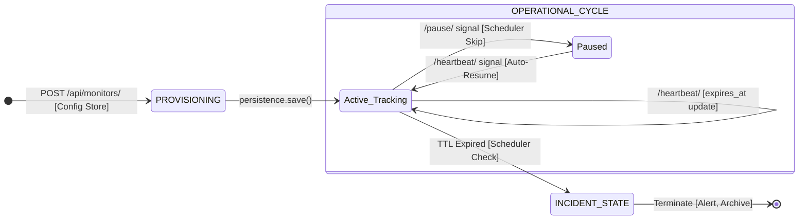

# Pulse-Check API — Watchdog Sentinel

A Dead Man's Switch API for monitoring remote devices. Devices register a monitor with a countdown timer; if no heartbeat arrives before the timer expires, the system fires an alert automatically.

---

## Architecture Diagram



---

## Setup

**Prerequisites:** Python 3.10+

```bash
git clone https://github.com/SHYAKA-Aime/AmaliTech-DEG-Project-based-challenges.git
cd AmaliTech-DEG-Project-based-challenges/backend/Pulse-Check

python3 -m venv venv
source venv/bin/activate

pip install -r requirements.txt

python manage.py migrate
python manage.py runserver
```

The API is now live at `http://127.0.0.1:8000/api/`.

---

## API Documentation

Base URL: `http://127.0.0.1:8000/api`

| Method | Endpoint | Description |
|--------|----------|-------------|
| `POST` | `/monitors/` | Register a new monitor |
| `GET` | `/monitors/` | List all monitors |
| `GET` | `/monitors/{id}/` | Get a single monitor |
| `POST` | `/monitors/{id}/heartbeat/` | Reset the countdown timer |
| `POST` | `/monitors/{id}/pause/` | Pause monitoring |
| `DELETE` | `/monitors/{id}/` | Remove a monitor |

---

### POST `/monitors/` — Register a Monitor

Request:
```json
{
  "id": "device-123",
  "timeout": 60,
  "alert_email": "admin@critmon.com"
}
```

Response `201 Created`:
```json
{
  "message": "Monitor 'device-123' registered successfully.",
  "monitor": {
    "id": "device-123",
    "timeout": 60,
    "alert_email": "admin@critmon.com",
    "status": "active",
    "expires_at": "2024-01-15T10:01:00Z",
    "last_heartbeat": null,
    "created_at": "2024-01-15T10:00:00Z"
  }
}
```

---

### POST `/monitors/{id}/heartbeat/` — Send Heartbeat

Response `200 OK`:
```json
{"message": "Heartbeat received. Timer has been reset to 60 seconds."}
```

Response `404 Not Found`:
```json
{"error": "No monitor with ID 'device-123' was found."}
```

Response `409 Conflict` (monitor is down):
```json
{"error": "Monitor 'device-123' has already gone down. Please register a new monitor to start tracking it again."}
```

---

### POST `/monitors/{id}/pause/` — Pause a Monitor

Response `200 OK`:
```json
{"message": "Monitor 'device-123' has been paused. Send a heartbeat to resume monitoring."}
```

---

### DELETE `/monitors/{id}/` — Remove a Monitor

Response `200 OK`:
```json
{"message": "Monitor 'device-123' has been removed successfully."}
```

---

### Alert Output

When a monitor's timer expires the server logs an alert and sends a simulated email to the registered `alert_email`:

```
[ALERT] {
  "ALERT": "Device device-123 is down!",
  "time": "2024-01-15T10:01:05.123456+00:00",
  "alert_email": "admin@critmon.com"
}
```

---

## Developer's Choice — Status Dashboard Endpoints

`GET /api/monitors/` and `GET /api/monitors/{id}/` were added as the Developer's Choice feature.

The core spec covered only writing to the system (register, heartbeat, pause) with no way to read state back. Without these endpoints, an on-call engineer who receives an alert has no way to check whether a device is truly down or just paused for maintenance. These two endpoints are the minimum observability layer needed to make the system usable in production.
